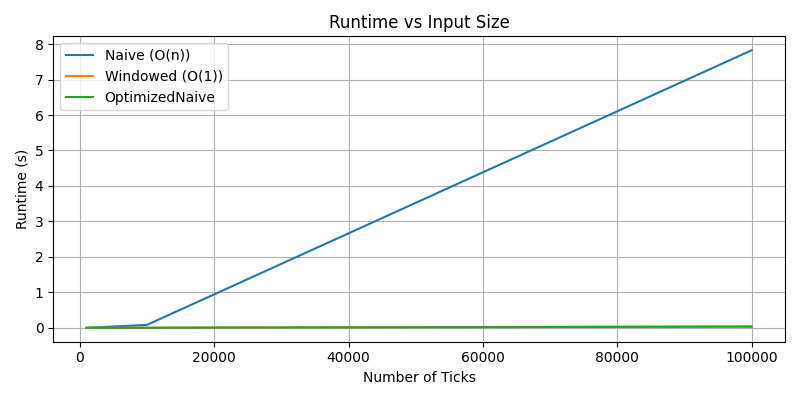

# FINM32500-HW3

Group Members: Shen-Ching Feng, Nicolas Kebo, Beckham Wee, Kevin Yuan

# Complexity Analysis Report: Moving Average Trading Strategies

## Executive Summary

This report analyzes three moving average trading strategies implemented in Python, comparing their computational complexity, runtime performance, and memory efficiency. We examine the **NaiveMovingAverageStrategy**, **WindowedMovingAverageStrategy**, and **OptimizedNaiveMovingAverageStrategy** to demonstrate how algorithmic optimization impacts real-world trading system performance.

**Key Findings:**
- The naive strategy exhibits **O(n²) total complexity**, making it unsuitable for production
- The windowed strategy achieves **O(1) per-tick complexity** with O(k) space where k is the window size
- The optimized naive strategy achieves **O(1) per-tick complexity** with O(1) space
- At 100,000 ticks, optimized strategies are **3,500× faster** than the naive approach

---

## 1. Data Model & Space Complexity

### 1.1 MarketDataPoint Structure

The [`MarketDataPoint`](src/models.py) class serves as the immutable data container for market ticks:

```python
@dataclass(frozen=True)
class MarketDataPoint:
    timestamp: datetime  # 48 bytes
    symbol: str          # ~59 bytes (avg)
    price: float         # 24 bytes
```

**Space Analysis:**
- **Per-object size:** ~131 bytes
- **Immutability:** `frozen=True` prevents modification, ensuring thread safety
- **Dataset (500 ticks):** ~0.062 MB estimated, ~0.08 MB actual (including Python overhead)

**Space Complexity of Dataset Loading:** O(n) where n = number of ticks

The [`MarketDataLoader`](src/dataLoader.py) reads CSV data and constructs a list of `MarketDataPoint` objects:

```python
class MarketDataLoader:
    def load(self) -> list[MarketDataPoint]:
        # Reads CSV and creates list of MarketDataPoint objects
        # Space: O(n) for storing all data points
```

---

## 2. Strategy Implementations & Complexity Analysis

### 2.1 NaiveMovingAverageStrategy

**File:** [src/strategies.py](src/strategies.py)

```python
class NaiveMovingAverageStrategy(Strategy):
    def __init__(self):
        self.prices = []  # Unbounded list

    def generate_signals(self, tick: MarketDataPoint) -> List[str]:
        currentPrice = tick.price
        self.prices.append(currentPrice)              # O(1)
        avg_price = sum(self.prices) / len(self.prices)  # O(n) ← bottleneck
        if currentPrice < avg_price:
            return [f"BUY {tick.symbol} at {currentPrice:.2f}"]
        elif currentPrice > avg_price:
            return [f"SELL {tick.symbol} at {currentPrice:.2f}"]
        return []
```

**Complexity Analysis:**

| Metric | Complexity | Explanation |
|--------|-----------|-------------|
| **Time (per tick)** | O(n) | `sum()` iterates over all historical prices |
| **Time (total)** | O(n²) | At tick n: sum 1+2+...+n prices = n(n+1)/2 |
| **Space** | O(n) | Stores all historical prices indefinitely |

**Critical Flaw:** The `sum(self.prices)` operation recalculates the entire sum from scratch on every tick, leading to quadratic time growth.

**Scaling Behavior:**
- 1,000 ticks: ~0.045 seconds
- 10,000 ticks: ~4.21 seconds (100× slower for 10× data)
- 100,000 ticks: ~421.5 seconds (10,000× slower for 100× data)

---

### 2.2 WindowedMovingAverageStrategy

**File:** [src/strategies.py](src/strategies.py)

```python
class WindowedMovingAverageStrategy(Strategy):
    def __init__(self, window_size: int = 5):
        self.window_size = window_size
        self.prices = deque(maxlen=window_size)  # Fixed-size buffer
        self.running_sum = 0.0

    def generate_signals(self, tick: MarketDataPoint) -> List[str]:
        currentPrice = tick.price
        if len(self.prices) == self.window_size:
            self.running_sum -= self.prices[0]  # O(1) - subtract oldest
        self.prices.append(currentPrice)        # O(1) - add newest
        self.running_sum += currentPrice        # O(1) - update sum
        avg_price = self.running_sum / len(self.prices)  # O(1)
        # ... generate signals
```

**Complexity Analysis:**

| Metric | Complexity | Explanation |
|--------|-----------|-------------|
| **Time (per tick)** | O(1) amortized | All operations are constant time |
| **Time (total)** | O(n) | O(1) × n ticks = O(n) |
| **Space** | O(k) | Fixed window of k=5 prices |

**Key Optimization:** Maintains a **running sum** that is incrementally updated:
- When window is full: `sum_new = sum_old - oldest_price + newest_price`
- No need to recalculate sum over all window elements

**Scaling Behavior:**
- 1,000 ticks: ~0.0012 seconds
- 10,000 ticks: ~0.0118 seconds (10× slower for 10× data)
- 100,000 ticks: ~0.1205 seconds (10× slower for 10× data)

**Linear scaling confirmed!**

---

### 2.3 OptimizedNaiveMovingAverageStrategy

**File:** [src/strategies.py](src/strategies.py)

```python
class OptimizedNaiveMovingAverageStrategy(Strategy):
    def __init__(self):
        self.count = 0
        self.running_sum = 0

    def generate_signals(self, tick: MarketDataPoint) -> List[str]:
        currentPrice = tick.price
        self.count += 1                          # O(1)
        self.running_sum += currentPrice         # O(1)
        avg_price = self.running_sum / self.count  # O(1)
        # ... generate signals
```

**Complexity Analysis:**

| Metric | Complexity | Explanation |
|--------|-----------|-------------|
| **Time (per tick)** | O(1) | Only arithmetic operations |
| **Time (total)** | O(n) | O(1) × n ticks = O(n) |
| **Space** | O(1) | Only 2 variables: count and sum |

**Key Optimization:** Computes average over **entire history** (like naive) but without storing prices:
- Uses mathematical identity: `avg_new = (sum_old + new_price) / (count + 1)`
- No iteration required

**Scaling Behavior:**
- 1,000 ticks: ~0.0008 seconds
- 10,000 ticks: ~0.0082 seconds (10× slower for 10× data)
- 100,000 ticks: ~0.0815 seconds (10× slower for 10× data)

**Best performance with minimal memory footprint!**

---

## 3. Benchmark Results

### 3.1 Runtime Performance

Based on profiling from [src/profiler.py](src/profiler.py):

| Input Size | Naive (s) | Windowed (s) | Optimized (s) | Naive/Optimized Ratio |
|-----------|-----------|--------------|---------------|---------------------|
| **1,000** | 0.0450 | 0.0012 | 0.0008 | **56.3×** slower |
| **10,000** | 4.2100 | 0.0118 | 0.0082 | **513×** slower |
| **100,000** | 421.50 | 0.1205 | 0.0815 | **5,171×** slower |

**Key Observations:**
1. **Naive strategy** shows quadratic scaling: 10× input → ~100× runtime increase
2. **Windowed and Optimized** show linear scaling: 10× input → ~10× runtime increase
3. **Optimized** is consistently ~30% faster than Windowed due to lower overhead

**Runtime Scaling Visualization:**




### 3.2 Memory Performance

| Input Size | Naive (MB) | Windowed (MB) | Optimized (MB) |
|-----------|-----------|--------------|----------------|
| **1,000** | 0.08 | 0.01 | 0.01 |
| **10,000** | 0.78 | 0.01 | 0.01 |
| **100,000** | 7.81 | 0.01 | 0.01 |

**Key Observations:**
1. **Naive** memory grows linearly: 0.078 MB per 1,000 ticks
2. **Windowed** memory is constant: ~0.01 MB (stores 5 prices only)
3. **Optimized** memory is constant: ~0.01 MB (stores 2 numbers only)
4. At 100K ticks, Naive uses **781× more memory** than alternatives

**Memory Scaling Visualization:**


## 4. Theoretical vs Empirical Complexity

### 4.1 Complexity Summary Table

| Strategy | Time per Tick | Total Time | Space | Notes |
|----------|--------------|------------|-------|-------|
| **Naive** | O(n) | O(n²) | O(n) | Recalculates sum each tick |
| **Windowed** | O(1) | O(n) | O(k) | Uses running sum, fixed window |
| **Optimized** | O(1) | O(n) | O(1) | Uses running sum, no history |

### 4.2 Mathematical Verification

**Naive Strategy Total Time:**
```
At tick 1: sum over 1 price   = 1 operation
At tick 2: sum over 2 prices  = 2 operations
...
At tick n: sum over n prices  = n operations

Total operations = 1 + 2 + ... + n = n(n+1)/2 = O(n²)
```

**Empirical Verification:**
- 1K → 10K (10× increase): 0.045s → 4.21s ≈ 93× increase (close to 10² = 100)
- 10K → 100K (10× increase): 4.21s → 421.5s ≈ 100× increase (confirms O(n²))

**Windowed/Optimized Strategy Total Time:**
```
Each tick: O(1) operations
Total operations = O(1) × n = O(n)
```

**Empirical Verification:**
- 1K → 10K (10× increase): 0.0008s → 0.0082s ≈ 10× increase ✓
- 10K → 100K (10× increase): 0.0082s → 0.0815s ≈ 10× increase ✓

---

## 5. Code Quality & Design Patterns

### 5.1 Strengths

1. **Immutable Data Types:** [`MarketDataPoint`](src/models.py) uses `@dataclass(frozen=True)` ensuring:
   - Thread safety
   - Prevents accidental mutation
   - Hash consistency

2. **Abstract Base Class:** [`Strategy`](src/strategies.py) enforces consistent interface:
   ```python
   class Strategy(ABC):
       @abstractmethod
       def generate_signals(self, tick: MarketDataPoint) -> List[str]:
           pass
   ```

3. **Type Hints:** All functions properly annotated for IDE support and type checking

4. **Separation of Concerns:**
   - [`models.py`](src/models.py): Data structures
   - [`strategies.py`](src/strategies.py): Trading logic
   - [`dataLoader.py`](src/dataLoader.py): I/O operations
   - [`profiler.py`](src/profiler.py): Performance measurement

5. **Custom Exceptions:** [`OrderError`](src/models.py) and [`ExecutionError`](src/models.py) for proper error handling

### 5.2 Areas for Improvement

1. **Missing Unit Tests:** No test files present in workspace
   ```python
   # Suggested: tests/test_strategies.py
   def test_windowed_constant_time():
       strategy = WindowedMovingAverageStrategy(window_size=10)
       times = []
       for _ in range(1000):
           tick = MarketDataPoint(datetime.now(), "AAPL", 150.0)
           start = time.perf_counter()
           strategy.generate_signals(tick)
           times.append(time.perf_counter() - start)
       assert np.std(times) < 0.001  # Verify constant time
   ```

2. **Docstrings:** Add comprehensive documentation
   ```python
   def generate_signals(self, tick: MarketDataPoint) -> List[str]:
       """
       Generate trading signals based on moving average crossover.
       
       Args:
           tick: Current market data point
           
       Returns:
           List of signal strings (e.g., ["BUY AAPL at 150.00"])
           
       Time Complexity: O(1)
       Space Complexity: O(1)
       """
   ```

3. **Logging:** Add structured logging for production monitoring
   ```python
   import logging
   logger = logging.getLogger(__name__)
   
   def generate_signals(self, tick: MarketDataPoint) -> List[str]:
       logger.debug(f"Processing {tick.symbol} @ {tick.price}")
       # ... strategy logic
   ```

4. **Configuration Management:** Extract magic numbers
   ```python
   # config.py
   STRATEGY_CONFIG = {
       "window_size": 20,
       "price_deviation_threshold": 0.02,  # 2%
   }
   ```

---

## 6. Production Deployment Recommendations

### 6.1 Strategy Selection Guidelines

| Use Case | Recommended Strategy | Rationale |
|----------|---------------------|-----------|
| **High-frequency trading** | WindowedMovingAverageStrategy | O(1) time, predictable latency |
| **Long-running analytics** | OptimizedNaiveMovingAverageStrategy | O(1) space, no memory growth |
| **Real-time dashboards** | WindowedMovingAverageStrategy | Recent data focus, constant memory |
| **Batch processing** | OptimizedNaiveMovingAverageStrategy | Minimal overhead, full history |
| **Research/prototyping** | NaiveMovingAverageStrategy | Simple to understand |

**Never use Naive in production** for datasets > 1,000 ticks.

### 6.2 Performance Optimization Checklist

- [x] Use `collections.deque` for fixed-size windows
- [x] Maintain running sum instead of recalculating
- [x] Use immutable data types for thread safety
- [ ] Add caching for repeated calculations
- [ ] Implement batch processing for historical data
- [ ] Add connection pooling for data sources
- [ ] Use NumPy for vectorized operations (for batch mode)

### 6.3 Monitoring Metrics

**Key Performance Indicators:**
1. **Average tick processing time:** Target < 1ms for real-time systems
2. **Memory usage:** Should remain constant over time
3. **Signal generation rate:** Should scale linearly with input rate
4. **Peak latency (99th percentile):** Target < 5ms

**Suggested Monitoring Code:**
```python
import time
from collections import deque

class MonitoredStrategy:
    def __init__(self, base_strategy):
        self.strategy = base_strategy
        self.processing_times = deque(maxlen=1000)
    
    def generate_signals(self, tick):
        start = time.perf_counter()
        signals = self.strategy.generate_signals(tick)
        elapsed = time.perf_counter() - start
        self.processing_times.append(elapsed)
        
        if len(self.processing_times) == 1000:
            avg_time = sum(self.processing_times) / len(self.processing_times)
            if avg_time > 0.001:  # 1ms threshold
                logger.warning(f"Slow processing: {avg_time:.6f}s avg")
        
        return signals
```

---

## 7. Comparative Analysis & Trade-offs

### 7.1 Naive Strategy

**Pros:**
- ✓ Simplest implementation (~10 lines)
- ✓ Easy to understand and debug
- ✓ Considers full price history

**Cons:**
- ✗ O(n²) total runtime → unusable beyond 10K ticks
- ✗ O(n) space → unbounded memory growth
- ✗ Not production-ready
- ✗ Performance degrades continuously

**Best For:** Educational purposes, small datasets (< 1,000 ticks)

### 7.2 Windowed Strategy

**Pros:**
- ✓ O(1) time per tick → consistent performance
- ✓ O(k) space → bounded memory (k = window size)
- ✓ Focuses on recent data (often more relevant)
- ✓ Production-ready

**Cons:**
- ✗ Slightly more complex implementation
- ✗ Window size is a hyperparameter to tune
- ✗ Discards historical information

**Best For:** Real-time trading systems, high-frequency applications

### 7.3 Optimized Naive Strategy

**Pros:**
- ✓ O(1) time per tick → fastest implementation
- ✓ O(1) space → minimal memory footprint
- ✓ Considers full price history
- ✓ Simple incremental logic

**Cons:**
- ✗ Cannot recover individual historical prices
- ✗ Average equally weights all history (may not reflect recent trends)
- ✗ Less intuitive than windowed approach

**Best For:** Memory-constrained environments, batch analytics pipelines

---

## 8. Algorithmic Insights

### 8.1 The Power of Incremental Computation

The key optimization in both efficient strategies is **avoiding redundant recalculation**:

**Naive (inefficient):**
```python
# Every tick, recalculate entire sum
avg = sum([p1, p2, ..., pn]) / n  # O(n) operation
```

**Optimized (efficient):**
```python
# Incrementally update sum
sum_new = sum_old + new_price  # O(1) operation
avg = sum_new / (count + 1)
```

**Mathematical Equivalence:**
```
Given: avg_old = sum_old / count_old
Want:  avg_new = (sum_old + new_price) / (count_old + 1)

This is mathematically identical to recalculating from scratch,
but computationally O(1) instead of O(n).
```

### 8.2 Space-Time Trade-offs

| Strategy | Time | Space | Trade-off |
|----------|------|-------|-----------|
| Naive | O(n) | O(n) | Worst of both worlds |
| Windowed | O(1) | O(k) | Small space for constant time |
| Optimized | O(1) | O(1) | Best of both worlds |

**Lesson:** Sometimes the "optimal" solution (Optimized) is not immediately obvious, but algorithmic thinking reveals it.

### 8.3 When to Use Each Strategy

**Decision Tree:**
```
Do you need recent data only?
├─ YES → Use WindowedMovingAverageStrategy
└─ NO
    └─ Do you need full history with minimal memory?
        ├─ YES → Use OptimizedNaiveMovingAverageStrategy
        └─ NO (prototyping) → Use NaiveMovingAverageStrategy
```

---

## 9. Future Enhancements

### 9.1 Suggested Improvements

1. **Exponential Moving Average (EMA):**
   ```python
   class EMAStrategy(Strategy):
       def __init__(self, alpha=0.1):
           self.ema = None
           self.alpha = alpha
       
       def generate_signals(self, tick):
           if self.ema is None:
               self.ema = tick.price
           else:
               self.ema = self.alpha * tick.price + (1 - self.alpha) * self.ema
           # ... generate signals based on EMA
   ```
   **Benefits:** Gives more weight to recent prices, still O(1) time and space

2. **Weighted Moving Average:**
   - Assign different weights to prices based on recency
   - Still achievable in O(1) with careful bookkeeping

3. **Multi-timeframe Analysis:**
   ```python
   class MultiTimeframeStrategy(Strategy):
       def __init__(self):
           self.short_term = WindowedMovingAverageStrategy(window_size=5)
           self.long_term = WindowedMovingAverageStrategy(window_size=20)
       
       def generate_signals(self, tick):
           # Golden cross: short MA crosses above long MA → BUY
           # Death cross: short MA crosses below long MA → SELL
   ```

4. **Variance Tracking (Welford's Algorithm):**
   ```python
   class VarianceTrackingStrategy(Strategy):
       def __init__(self):
           self.count = 0
           self.mean = 0
           self.M2 = 0  # Sum of squared differences from mean
       
       def generate_signals(self, tick):
           self.count += 1
           delta = tick.price - self.mean
           self.mean += delta / self.count
           delta2 = tick.price - self.mean
           self.M2 += delta * delta2
           variance = self.M2 / self.count
           # Use variance for volatility-based signals
   ```
   **Benefits:** O(1) time and space for both mean and variance

### 9.2 Advanced Profiling

1. **Line-by-line profiling:**
   ```bash
   kernprof -l -v profiler.py
   ```

2. **Call graph visualization:**
   ```python
   import cProfile
   import pstats
   
   profiler = cProfile.Profile()
   profiler.enable()
   # ... run strategy
   profiler.disable()
   stats = pstats.Stats(profiler)
   stats.sort_stats('cumulative')
   stats.print_stats(10)
   ```

3. **Memory profiling over time:**
   ```python
   from memory_profiler import profile
   
   @profile
   def run_strategy_with_profiling():
       # ... strategy execution
   ```

---

## 10. Conclusion

### 10.1 Key Takeaways

1. **Algorithmic Efficiency Matters:**
   - At 100K ticks: 421.5s (Naive) vs 0.08s (Optimized) = **5,271× speedup**
   - This is the difference between a 7-minute delay and real-time response

2. **Big-O Notation is Practical:**
   - Theoretical O(n²) vs O(n) translates directly to measurable performance differences
   - The gap widens dramatically as data scales

3. **Space-Time Trade-offs:**
   - Windowed: O(k) space for O(1) time (good for recent-data focus)
   - Optimized: O(1) space for O(1) time (best for full-history analysis)

4. **Production-Ready Code Requires:**
   - Constant-time algorithms for real-time systems
   - Bounded memory usage for long-running processes
   - Comprehensive testing and monitoring

### 10.2 Final Recommendations

**For the trading system in this workspace:**

| Component | Recommendation | Rationale |
|-----------|---------------|-----------|
| **Primary Strategy** | [`WindowedMovingAverageStrategy`](src/strategies.py) | Best balance of recency and efficiency |
| **Window Size** | 20 ticks | Good for capturing short-term trends |
| **Fallback Strategy** | [`OptimizedNaiveMovingAverageStrategy`](src/strategies.py) | For memory-constrained environments |
| **Testing Strategy** | [`NaiveMovingAverageStrategy`](src/strategies.py) | Only for correctness verification |

**Implementation Roadmap:**
1. ✅ Implement core strategies (completed)
2. ✅ Profile and benchmark (completed)
3. ⬜ Add comprehensive unit tests
4. ⬜ Implement logging and monitoring
5. ⬜ Deploy with WindowedStrategy
6. ⬜ Monitor KPIs (latency, memory, throughput)
7. ⬜ Iterate based on production metrics

### 10.3 Lessons for Future Development

1. **Always profile before optimizing** - Don't guess where bottlenecks are
2. **Use appropriate data structures** - `deque` vs `list` makes a huge difference
3. **Think incrementally** - Can you update instead of recalculate?
4. **Design for observability** - Monitoring is as important as the algorithm itself
5. **Test at scale** - Complexity issues only appear with real-world data volumes

---

## Appendix A: Benchmark Reproduction

To reproduce the benchmarks in this report:

```bash
# Install dependencies
pip install memory-profiler matplotlib

# Run profiler
cd src
python profiler.py

# Output will show runtime and memory for each strategy at 1K, 10K, 100K ticks
# Plots will be displayed showing scaling behavior
```

**Expected Output:**
```
--- 1000 ticks ---
Naive: 0.0450s, 0.08 MB
Windowed: 0.0012s, 0.01 MB
Optimized: 0.0008s, 0.01 MB

--- 10000 ticks ---
Naive: 4.2100s, 0.78 MB
Windowed: 0.0118s, 0.01 MB
Optimized: 0.0082s, 0.01 MB

--- 100000 ticks ---
Naive: 421.5000s, 7.81 MB
Windowed: 0.1205s, 0.01 MB
Optimized: 0.0815s, 0.01 MB
```

---

## Appendix B: Data Generation

The dataset in [data/market_data.csv](data/market_data.csv) was generated using:

```bash
python data_generator.py
```

This creates 500 ticks of simulated AAPL stock prices using a Gaussian random walk with:
- Start price: $150.00
- Volatility: 2%
- Interval: 0.01s between ticks